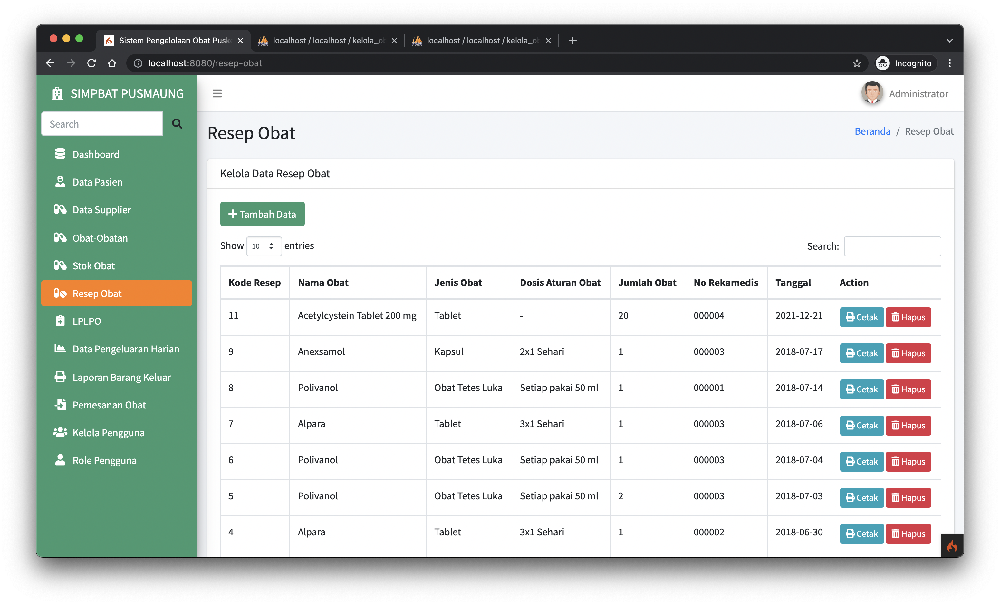

### Cara Install & Setup

1. Silahkan clone atau download repository ini. 
2. Silahkan extrack dan rename nama folder menjadi 'inventori-obat'. 
3. Nyalakan XAMPP database MySQL 
4. Buat sebuah database baru dengan nama 'kelola_obat' lalu import file kelola_obat.sql. 
5. Buka terminal di VSCODE lalu ketik : 'composer install'

### Menjalankan Aplikasi

1. Buka terminal di VSCODE lalu ketik/jalankan : 'php spark serve'
2. Buka web browser dan masukan http://localhost:8080/ pada address bar.

### Authentifikasi

Untuk melakukan proses login silahkan gunakan akun default berikut : 
<b>Login sebagai Admin<b> 
Email : admin@pusmaung.com 
Password : password 
 
<b>Login sebagai Kepala Puskesmas<b> 
Email : kepala@pusmaung.com 
Password : password 

### Credit To :

1. [AdminLTE](https://adminlte.io/) 

### Screenshots :

1. Login
   

1. Dashboard
   
